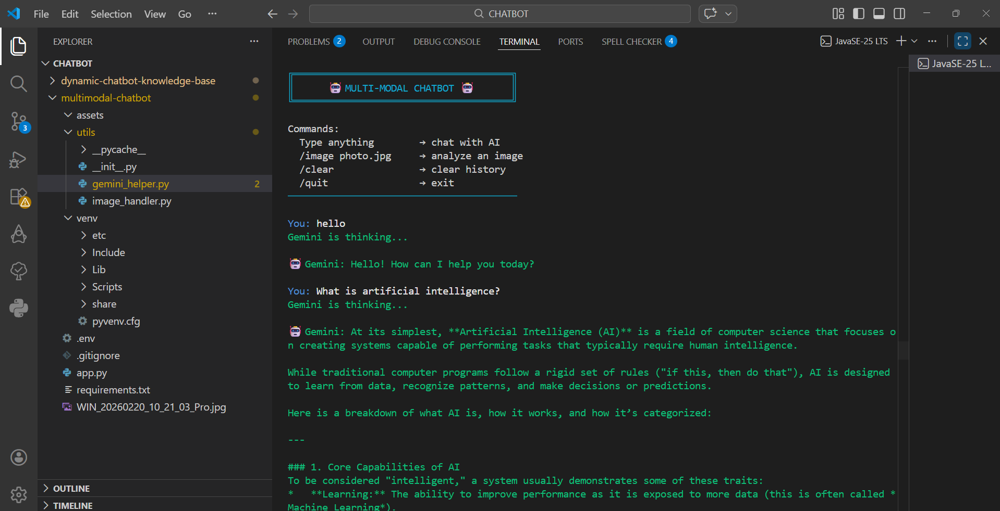
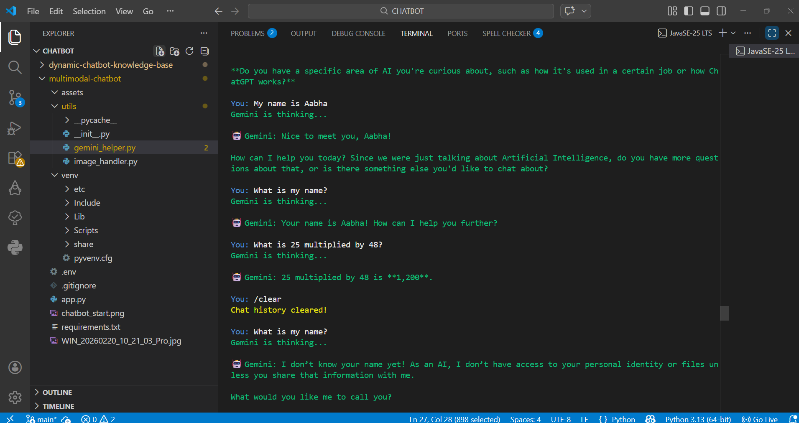
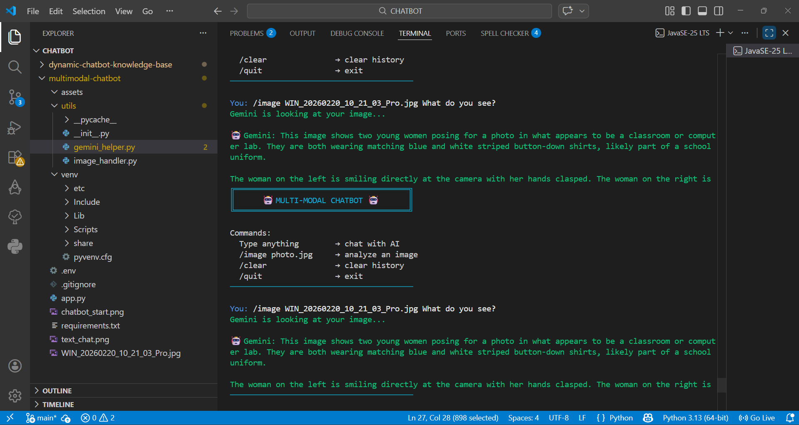

# 🤖 Multi-Modal Chatbot using Google Gemini AI

## 📌 Overview

The **Multi-Modal Chatbot** is an AI-powered conversational system capable of understanding **both text and image inputs**.
Unlike traditional chatbots that only process text, this chatbot integrates **Google Gemini AI** to analyze images and generate intelligent responses based on visual and textual information.

The chatbot runs through a **command-line interface (CLI)** where users can interact with the AI, ask questions, and upload images for analysis.

This project demonstrates how **multimodal AI systems** can combine **natural language processing and computer vision** to create more advanced conversational interfaces.

---

## ✨ Features

* 💬 **Text Interaction**
  Users can chat with the AI using natural language.

* 🖼 **Image Understanding**
  Upload an image and ask questions about it.

* 🔄 **Conversation History**
  Maintains previous messages for contextual responses.

* ⚡ **Command-based Interface**
  Simple commands make the chatbot easy to use.

* 🔍 **Image Validation**
  Supports `.jpg`, `.png`, and `.webp` image formats.

---

## 🧠 Technologies Used

* **Python**
* **Google Gemini AI API**
* **Pillow (Image Processing)**
* **Colorama (Terminal UI)**
* **Python Dotenv**
* **Requests Library**

---

## 📂 Project Structure

```
multimodal-chatbot
│
├── app.py                 # Main chatbot application
├── requirements.txt       # Project dependencies
├── README.md              # Project documentation
├── .gitignore             # Ignored files
│
├── utils
│   ├── gemini_helper.py   # Gemini API communication
│   └── image_handler.py   # Image processing functions
│
├── assets
│   └── sample.jpg         # Sample image for testing
│
└── screenshots
    ├── chatbot_start.png
    ├── text_chat.png
    └── image_analysis.png
```

---

## ⚙️ Installation

### 1️⃣ Clone the Repository

```
git clone https://github.com/yourusername/multimodal-chatbot.git
cd multimodal-chatbot
```

---

### 2️⃣ Create Virtual Environment

```
python -m venv venv
```

Activate the environment

**Windows**

```
venv\Scripts\activate
```

**Mac/Linux**

```
source venv/bin/activate
```

---

### 3️⃣ Install Dependencies

```
pip install -r requirements.txt
```

---

### 4️⃣ Add Gemini API Key

Create a `.env` file in the project folder:

```
GEMINI_API_KEY=your_api_key_here
```

---

## ▶️ Running the Chatbot

Run the application using:

```
python app.py
```

You will see the chatbot interface in the terminal.

---

## 💻 Available Commands

| Command            | Description                |
| ------------------ | -------------------------- |
| Type anything      | Chat with the AI           |
| `/image photo.jpg` | Analyze an image           |
| `/clear`           | Clear conversation history |
| `/quit`            | Exit chatbot               |

---

## 🖼 Example Usage

### Text Conversation

```
You: Hello
Gemini: Hello! How can I help you today?
```

---

### Image Analysis

```
You: /image sample.jpg What do you see in this image?
Gemini: The image appears to show...
```

---

## 📸 Demo

### Chatbot Interface



### Text Chat



### Image Analysis



---

## 🎯 Expected Outcome

The final system provides a **fully functional multi-modal chatbot** capable of:

* Understanding user queries
* Processing image inputs
* Generating intelligent responses
* Integrating visual and textual information

This demonstrates the **practical application of multimodal AI systems in conversational interfaces**.

---

## 🚀 Future Improvements

* Web interface using **Flask or Streamlit**
* Voice input and speech responses
* Image generation using AI
* Cloud deployment
* Integration with knowledge bases

---

## 📚 References

* Google Gemini AI Documentation
* Python Official Documentation
* Pillow Library Documentation
